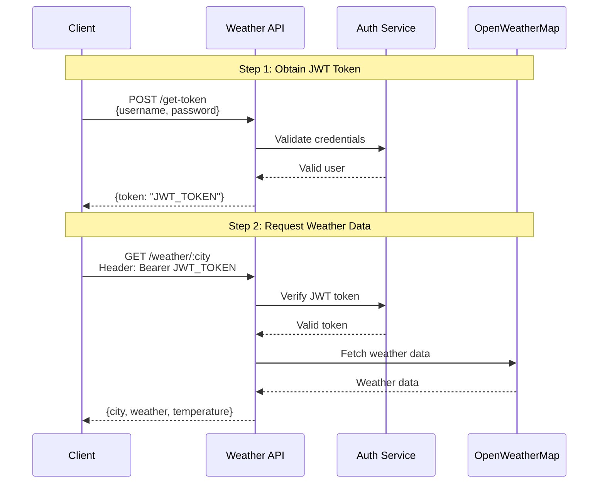
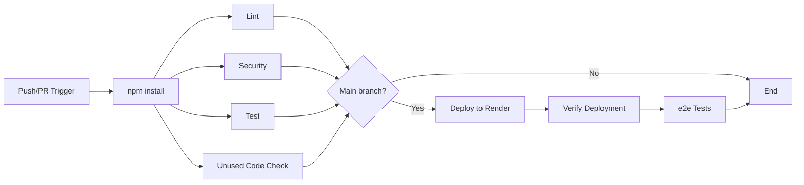

# Typescript OpenWeather API

A Typescript web project providing a simple weather API, along with caching, logs, metrics and CI/CD.

Live app: https://openweather-typescript-priv.onrender.com


## Table of contents

- [Usage](#usage)
- [Required Environment Variables](#required-environment-variables)
- [Architecture Decisions](#architecture-decisions)
- [CI/CD](#cicd)
- [Todo before production usage](#todo-before-production-usage)
- [Local environment](#local-environment)
- [Wakeup Cronjob](#wakeup-cronjob)


## Usage

### Available routes


| Route              | Description                                                  |
|--------------------|--------------------------------------------------------------|
| `/get-token`       | Generates authentication token from user credentials         |
| `/weather/${city}` | Queries weather for a specific city                          |
| `/status`          | Provides domain config values and current checkout commit    |
| `/metrics`         | Exposes various metrics for monitoring purposes              |


### Authentication

- `/weather/${city}` endpoint requires authentication: A JWT Bearer token needs to be provided in request header such as `Authorization: Bearer ${TOKEN}`
- A JWT Bearer token should therefore be generated beforehand using `/get-token` endpoint, using valid user credentials:
   - Header must include `Content-Type: application/json`
   - Request must include data payload `{"username":"test","password":"password"}`




### Requesting weather / TLDR

- Shell one-liner:
```shell
URL="https://openweather-typescript-priv.onrender.com" TOKEN=$(curl -s -X POST ${URL}/get-token -H "Content-Type: application/json" -d '{"username":"test","password":"password"}' | jq -r '.token') && curl -X GET ${URL}/weather/paris -H "Authorization: Bearer ${TOKEN}"
```
> Replace `test` and `password` values by real ones you were given

- API should return something like:
```json
{
  "city": "Paris",
  "weather": "Clouds",
  "temperature": 13.34
}
```

### Caching

Weather data requested is cached to reduce API calls and improve response times:
- In-memory storage using `node-cache` (data is not persisted across server restart)
- City name is used as cache key
- TTL is configurable via `CACHE_TTL_SECONDS` environment variable (defaults to 600 seconds, aka 10 minutes)
- Hits and misses are tracked and exposed to `/metrics` endpoint
- HTTP response headers include `X-Cache-Status` which can either be `HIT` or `MISS`
```http
HTTP/1.1 200 OK
X-Powered-By: Express
X-Cache-Status: HIT
Content-Type: application/json; charset=utf-8
Content-Length: 55
ETag: W/"37-AbUcQxcFEys/mKWB9iu2VMPedek"
Date: Sun, 02 Nov 2025 13:10:00 GMT
Connection: keep-alive
Keep-Alive: timeout=5
```

When a weather request is received, the cache is checked first:
- On cache hit, data is returned immediately
- On cache miss, data is fetched from OpenWeatherMap API and stored in cache for later requests


### Logs

- Logs are generated by Node.js process, according to configured LOG_LEVEL (defaults to WARN):

```shell
API listening at port 3000
[2025-11-01T16:22:22.514Z] WARN: Authentication attempt with missing credentials
[2025-11-01T16:22:22.517Z] WARN: Failed authentication attempt {"username":"wrong"}
[2025-11-01T16:22:22.523Z] WARN: Request without authorization header {"path":"/london"}
[2025-11-01T16:22:22.525Z] WARN: Invalid token verification {"path":"/london","error":"jwt malformed"}
[2025-11-01T16:22:26.455Z] ERROR: Failed to fetch weather data {"city":"parissss","error":"Request failed with status code 404"}
```

### Metrics

- Metrics are collected to keep track of all HTTP requests and monitors start/finish of events
- Data is stored in-memory (not persisted across server restart)
- Statistics are exposed for each route and include: 
  - Performance data: Min, max, and average response times per endpoint
  - Error tracking: HTTP errors are counted (status code >= 400) and detailed by status code

- Metrics are available in json format at `/metrics`:
```json
{
  "uptimeSeconds": 19,
  "requests": {
    "total": 12
  },
  "endpoints": {
    "GET /status": {
      "count": 1,
      "avgDurationMs": 14,
      "minDurationMs": 14,
      "maxDurationMs": 14
    },
    "GET /metrics": {
      "count": 1,
      "avgDurationMs": 1,
      "minDurationMs": 1,
      "maxDurationMs": 1
    },
    "POST /get-token": {
      "count": 4,
      "avgDurationMs": 2,
      "minDurationMs": 0,
      "maxDurationMs": 3
    },
    "GET /weather/:city": {
      "count": 6,
      "avgDurationMs": 75,
      "minDurationMs": 0,
      "maxDurationMs": 209
    }
  },
  "cache": {
    "hits": 1,
    "misses": 3,
    "hitRate": 25
  },
  "errors": {
    "total": 5,
    "byStatusCode": {
      "400": 1,
      "401": 2,
      "403": 1,
      "500": 1
    }
  }
}
```

Metrics could be further improved and be fed to dedicated third-party tools:
1. Prometheus or similar time-series database to store data history
3. Performance monitoring oriented tools such as New Relic or DataDog
2. Grafana dashboards (or any other tool) for visualization and alerting
4. Where alerts could be configured in case of specific events:
   - High error rates
   - Slow response times for most users
   - Unexpectedly low cache hit rate
   - Service unavailable


## Required Environment Variables

| Name              | Description              | Environment                                     |
|-------------------|--------------------------|-------------------------------------------------|
| JWT_SECRET        | Secret string used as salt in JWT authentication       | Render            |
| OWM_API_KEY       | Secret API key to access OpenWeatherMap API            | Render            |
| RENDER_DEPLOY_KEY | Secret deploy key to deploy on render.com              | GitHub            |
| RENDER_APP_URL    | Public app URL used for e2e testing                    | GitHub            |
| E2E_AUTH_USERNAME | Secret username for e2e testing                        | GitHub + Render   |
| E2E_AUTH_PASSWORD | Secret password for e2e testing                        | GitHub + Render   |
| GROQ_API_KEY      | Secret API key used for check:unused testing           | GitHub            |


## Architecture Decisions

### Tech Stack

- Runtime: Node.js with TypeScript strictly configured
- Backend: Express for REST API
- Authentication: JWT-based token authentication, very common in APIs
   - Leveraging envvironement variables for a scoped implementation
- Caching: node-cache (in-memory), relevant strategy and TTL for displaying weather data that changes regularly but not so much
- Testing: Jest for unit and e2e, ESLint, npm audit, LLM-based dead code detection ([see it in action here](https://asciinema.org/a/y1AolXuIhr3mltIQP0TbWC33r))
- Development: tsx with Hot reload + .env file for quick overrides
- PAAS: Render.com for future evolutivity (ability to add database services and otherwise) + webhook deploy triggers


### Configuration

- All of app config is centralized in `src/config.ts`:
   - It provides default config values with sane defaults - overridable by environment variables / .env
   - Config is organized by domain: server, logging, weather, auth
   - Validation of required values happens at startup


### Directory Structure

```
src/
├── routes/       # Express HTTP handlers
├── services/     # Business logic (auth, weather, cache, logger, metrics) along with unit-testing
├── config.ts     # Configuration
└── app.ts        # Application entry point
dist/             # Build output
e2e/              # e2e tests definition
scripts/          # Custom scripts (LLM-based check-unused-code.js)
```


## CI/CD

- Several CI/CD jobs are setup in a [multi-step pipeline](https://github.com/davidferlay/typescript-openweather-api/actions/workflows/pipeline.yml) to ensure code quality, security, and automated deployments:
   - Pipeline is triggered by commits and pull requests to/from any branch
   - Install job runs first, then all test-oriented jobs run in parallel to optimize execution time
      - That pattern allows to add more job for test/quality/validation without making pipeline longer
   - Deployments to Render hosting run from `main` branch - after all quality checks have passed
   - Deployment verification job makes sure the expected version is live - then executes e2e tests against it
   - Branches other than `main` only run test checks, with no deployment

- Overview: 


### Jobs

| Job      | Purpose                  | Key Actions |
|----------|--------------------------|-------------|
| Install  | Dependencies setup       | - Checks out code<br>- Sets up Node.js 22.x<br>- Caches `node_modules`<br>- Installs dependencies via `npm clean-install` |
| Lint     | Code quality checks      | - Runs ESLint to enforce formatting and catch potential errors |
| Security | Vulnerability scanning   | - Runs `npm audit` to check for security vulnerabilities<br>- Checks for outdated dependencies |
| Test     | Code validation          | - TypeScript compilation check (`tsc --noEmit`)<br>- Runs build process to catch potential errors<br>- Executes all unit tests with coverage |
| Unused   | Dead code detection      | - Uses an LLM-based analysis (via GROQ API) to identify unused/dead code ([see it in action here](https://asciinema.org/a/y1AolXuIhr3mltIQP0TbWC33r))|
| Deploy   | Production deployment    | - Triggers deployment to Render PAAS via webhook |
| Verify   | Deployment validation    | - Waits for deployment to complete using auto-retry until time-out<br>- Curl `/status` route to check that deployed commit short SHA matches git one |
| e2e      | End-to-end testing       | - Runs functional/integration tests against the live environment to ensure critical business logic is up and running |


## Todo before production usage

### Changes required before deploying to production

- Upgrade `/get-token` endpoint to validate user credentials against a database or an identify provider (requires to setup a persistent database service both on cloud + locally, and a way to populate database with real users as well as test ones)
- Add authentication to `/metrics` and `/status` routes for security
- Remove `E2E_AUTH_USERNAME` and `E2E_AUTH_PASSWORD` environement variables from prod environement (keep only for preprod/dev environments)
- Update `/metrics` to expose additional useful metrics (such as per city calls, percentil performance p50 p95 p99)
- Update `/metrics` json format to Prometheus standard
- Store metrics data to database with persistante storage (to persist data accross server restart)
- Provide additional environement(s) for preprod/dev purposes, adapt CI-CD pipeline accordingly
- Improve CI pipeline with additional meaningful tests (technical as well as domain oriented)


### Other possible improvements

- Upgrade caching system to use a persistent database such as Redis (to persist data accross server restart)
   - Which would also provide a way to flush cache on-demand both globally and per cache-key
- Implement Hot reload of local environement when values from .env file are updated
- Migrate scripts/check-unused-code.js into a typescript sdk native Github action of it's own (using it's own repository and calling it in CI)
- Improve scripts/check-unused-code.js to use a privately self-hosted LLM instead of a public third-party one to garantee confidentiality of closed code


## Local environment

### .env example

```dotenv
# Required local config:
OWM_API_KEY=secret
JWT_SECRET=secret

# Optional config overrides:
PORT=3000
CACHE_TTL_SECONDS=60
LOG_LEVEL=INFO              # or ERROR, WARN, DEBUG
WEATHER_UNITS=metric        # imperial, standard

# Testing config:
E2E_AUTH_USERNAME=test
E2E_AUTH_PASSWORD=password
GROQ_API_KEY=secret
```

- Note that using environement variables works just as fine


### Common commands

As usual, commands can be found in the `script` section of `package.json`, here is the gist of it:

- Start local environment:
```shell
npm run dev
```
- Run tests individually:
```shell
npm run lint               # ESLint
npm run audit              # Dependency analysys
npm run test               # Unit-testing
npm run test:coverage      # Unit-testing coverage validation
npm run test:e2e           # e2e integration/functional business-logic testing
npm run check:unused       # Identify unused/dead code using LLM-based analysis (via GROQ API)
```
> `test:e2e` requires `E2E_AUTH_USERNAME` and `E2E_AUTH_PASSWORD` values to be present in `.env` file
> `check:unused` requires `GROQ_API_KEY` value to be present in `.env` file
- Run all tests:
```shell
npm run all
```
- Manually call API:
```shell
URL="http://localhost:3000" TOKEN=$(curl -s -X POST ${URL}/get-token -H "Content-Type: application/json" -d '{"username":"test","password":"password"}' | jq -r '.token') && curl -X GET ${URL}/weather/paris -H "Authorization: Bearer ${TOKEN}"
```


## Wake-up Cronjob

- Render's free tier apps automatically sleep after 15 minutes of inactivity, causing cold starts with ~30 second delays on first requests
- For convience, a cron-like Github Action job will keep Render app awaken during office hours for weeks 44, 45 and 46

